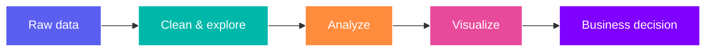

# Hi, I'm **Ashwin Goel** 👋

  

  I turn scattered data into sharp decisions — one insight, dashboard, and story at a time. 📊

  
  
  

## About me

- 🔎 **Focus:** business intelligence, product analytics, and data storytelling
- 🧠 **Strength:** translating messy data into clear, actionable recommendations
- 📍 **Based in:** India · ✉️ **Open to:** Data roles, freelance work and Buisness Analyst

## My analytics toolkit

  

  
  
  
  
  

## At a glance

| What I do | What it delivers |
| :-- | :-- |
| **Data cleaning & automation** | Reliable, analysis-ready datasets |
| **Exploratory analysis** | Trends, anomalies, and opportunities |
| **Dashboard design** | Fast, confident decision-making |
| **Insight communication** | Clear stories for non-technical teams |

## GitHub snapshot

  
  

<i>“Without data, you're just another person with an opinion.” — W. Edwards Deming</i>

